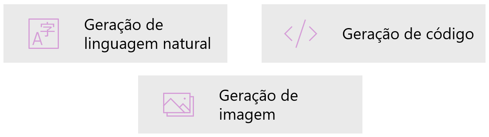
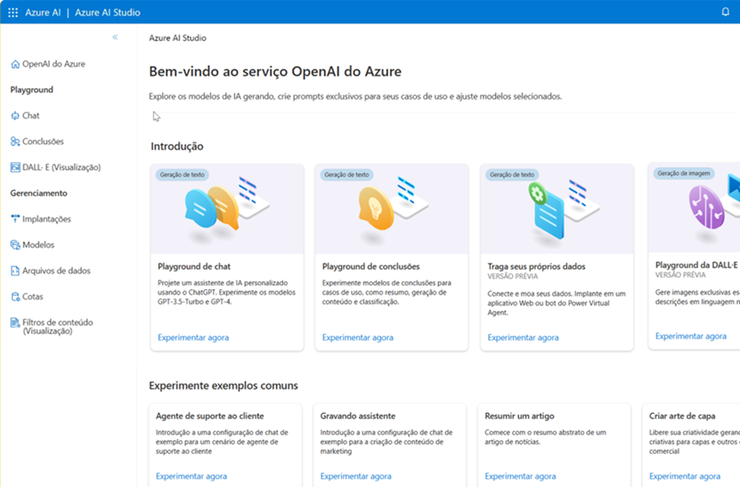

# Descrição do Desafio
Este laboratório tem como objetivo explorar as funcionalidades do Copiloto e das ferramentas da OpenAI, com ênfase nos filtros de conteúdo e nos recursos de criação assistida por inteligência artificial. O entregável consiste em um repositório organizado com exemplos de uso, prompts aplicados e anotações sobre os aprendizados adquiridos.

## Objetivos de Aprendizagem 
Ao concluir este desafio, você será capaz de: 

Aplicar os conceitos aprendidos em um ambiente prático;
Documentar processos técnicos de forma clara e estruturada; 
Utilizar o GitHub como ferramenta para compartilhamento de documentação técnica. 

## IA Generativa: 
Ela se concentra em imitar o comportamento humano usando técnicas de aprendizado de máquina, permitindo que os modelos interajam com o ambiente e executem tarefas sem instruções explícitas sobre o que gerar. Em vez de apenas analisar ou classificar dados existentes, a IA generativa é capaz de produzir conteúdo original, como texto, imagens, áudio e vídeo.

## Modelo de Linguagens Grandes

Os aplicativos de IA generativas são alimentados por LLMs, que são um tipo especializado de modelo de Machine Learning que você pode usar para executar tarefas de PLN (Processamento de Linguagem Natural), incluindo

- Determinar sentimento ou classificar de outra forma o texto em idioma natural.
- Resumir um texto.
- Comparar várias fontes de texto quanto à similaridade semântica.
- Geração de nova linguagem natural.

### Modelo Transformador

A arquitetura do modelo do transformador consiste em dois componentes principais, ou blocos

- Um bloco codificador que criar representações semânticas do vocabulário de treinamento.
- Um bloco decodificador que gerar novas sequências de linguagem.
- O texto é tokenizado para que cada palavrar ou frase seja representada por um token numérico exclusivo.
- Inserções (valores de vetor com várias dimensões são atribuídas aos tokens).
- As camadas de atenção examinam cada token por vez e determinam valores incorporados que refletem os relacionamentos semânticos entre os tokens.
- No decodificador, essas relações são usadas para prever a sequência mais provável de tokens.

### Modelo Tokenização

A primeira etapa no treinamento de um modelo de transformador é decompor o texto de treinamento em tokens.

### Modelo de Inserção

As relações entre tokens são capturadas como vetores, conhecidos como inserções.

### Modelo de Atenção

O modelo de atenção permite que redes neurais se concentrem em partes específicas de uma entrada (como uma frase ou um documento) ao fazer previsões. Em vez de processar todos os dados igualmente, ele aprende a dar mais "atenção" às partes mais relevantes.

- Capturar a força das relações entre tokens usando a técnica de atenção.

#### Exemplo:

Meta: prever o token após "cachorro".

- Represente "Ouvi um cachorro" como vetores.
- Atribua mais peso a "ouvi" e "cachorro".

	Vários tokens possíveis podem vir depois de cachorro.
	O token mais provável é adicionado à sequência, nesse caso , "latir".

## Copilotos

Os copilotos são frequentemente integrados a outros aplicativos e fornecem uma maneira para os usuários obterem ajuda com tarefas comuns a partir de um modelo generativo de IA.

- Os desenvolvedores podem criar copilotos que enviam prompts para grandes modelos de linguagem e geram conteúdo para uso em aplicativos.
- Os usuários empresariais podem usar copilotos para aumentar sua produtividade e criatividade com conteúdo gerado por IA.

Engenharia de Prompts
O termo engenharia de prompts descreve o processo de aprimoramento e otimização de prompts (as instruções ou perguntas dadas a um modelo de IA generativa) para obter respostas de melhor qualidade e mais relevantes. É a arte e a ciência de se comunicar eficazmente com a IA.

Tanto os desenvolvedores que projetam aplicativos de IA quanto os consumidores que usam esses aplicativos podem aprimorar a qualidade das respostas da IA generativa utilizando diversas técnicas:

Linguagem Direta e Explícita: Você pode obter conclusões mais úteis sendo explícito e direto sobre o tipo, formato e estilo de resposta que deseja. Evite ambiguidade.
Mensagens do Sistema (System Messages): Para chatbots e agentes de IA, as mensagens do sistema são instruções ou diretrizes ocultas fornecidas ao modelo para descrever como o chat deve funcionar, definir seu "persona" ou estabelecer regras de comportamento.
Fornecer Exemplos (Few-Shot Learning): Incluir exemplos de entrada e saída esperada no seu prompt (conhecido como "few-shot learning") ajuda o modelo a entender o padrão e o formato desejado para a resposta.
Dados de Fundamentação (Grounding Data): Fornecer informações adicionais ou contexto relevante (chamado de "grounding data") diretamente no prompt ou através de uma recuperação de informações, ajuda o modelo a basear suas respostas em fatos específicos e a evitar "alucinações".

## OpenAI do Azure
 
 É a solução de nuvem da Microsoft para implantar, personalizar e hospedar modelos de linguagens grandes.

## O serviço OpenAI do Azure consiste em:

- Modelos de IA gerativa predefinidos.
- Funcionalidades de personalização
- Ferramentas integradas para detectar e mitigar casos de uso prejudiciais para que os usuários possam implementar a IA com responsabilidade
- Segurança corporativa com RBAC (controle de acesso baseado em função) e redes privadas.

Você pode usar vários métodos para desenvolver soluções do Azure OpenAI:

- Estúdio de IA do Azure,
- API REST,
- SDKs com suporte e CLI do Azure.

## Modelos Suportados

- GPT-4 (Um conjunto de modelos que melhoram o GPT-3.5 e podem compreender e gerar linguagem e código naturais.)
- DALL-E (visualização) (Uma série de modelos em pré-visualização que podem gerar imagens originais a partir de linguagem natural.)
- GPT-3.5
- Incorporações (Um conjunto de modelos que podem converter texto em um formulário de vetor numérico para facilitar a similaridade de texto.)

## Como Utilizar o OpenAI do Azure

### Estúdio Azure OpenAI:

- Crie e implante modelos de IA para aplicativos de software
- Alimentado por modelos generativos de IA otimizados para diversas tarefas
- Criar e implantar modelos de IA para aplicativos de software
- Alimentado por modelos de IA gerativa otimizados para tarefas diversas
### Playgrounds:

- Experimente modelos Azure OpenAI sem codificação
- Use a configuração do assistente para instruir o modelo sobre como ele deve se comportar

## Funcionalidades de Linguagem Natural do OpenAI do Azure

Os modelos de GPT (transformadores pré-treinados generativos) são excelentes para entender e criar linguagem natural.
### Exemplo

### Resposta

Os modelos GPT traduzem linguagem natural ou trechos de código em código.

A geração de código vai além de apenas escrever código a partir de prompts em linguagem natural.

### Geração de Imagens

Os modelos de IA gerativa podem editar e criar imagens. O modelo que funciona com imagens é chamado DELL-E, que dá suporte à criação de imagem, edição de imagem e criação de variações de imagem.

Com o DALL-E você pode até solicitar uma imagem em um determinado estilo. Os estilos também podem ser usados para edições e variações.

DALL-E pode editar a imagem conforme solicitado, alterando seu estilo, adicionando ou removendo itens ou gerando novo conteúdo para adicionar.

variações de imagem podem ser criadas fornecendo uma imagem e especificando quantas variações da imagem você deseja.

Prompt: “Crie quatro variações da imagem de um elefante com um hambúrguer.”

## Documentações Oficiais 
[Explore generative AI with Microsoft Copilot](https://microsoftlearning.github.io/mslearn-ai-fundamentals/Instructions/Labs/12-generative-ai.html) - Laboratório no Microsoft Learning
[Explore Azure OpenAI - Laboratório no Microsoft Learning](https://microsoftlearning.github.io/mslearn-ai-studio/Instructions/01-Explore-ai-studio.html) - Laboratório no Microsoft Learning
[Explore content filters in Azure OpenAI - Laboratório no Microsoft Learning](https://microsoftlearning.github.io/mslearn-ai-studio/Instructions/06-Explore-content-filters.html) - Laboratório no Microsoft Learning

